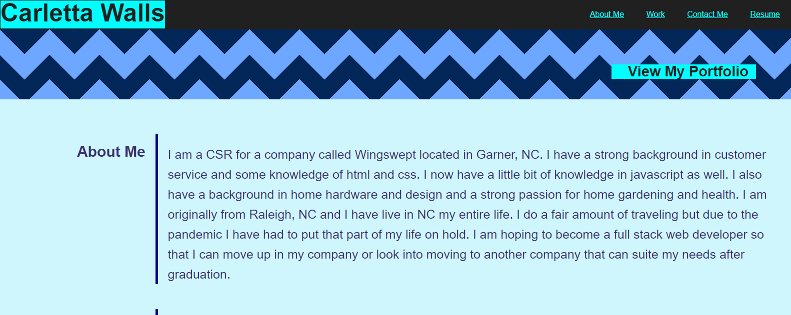
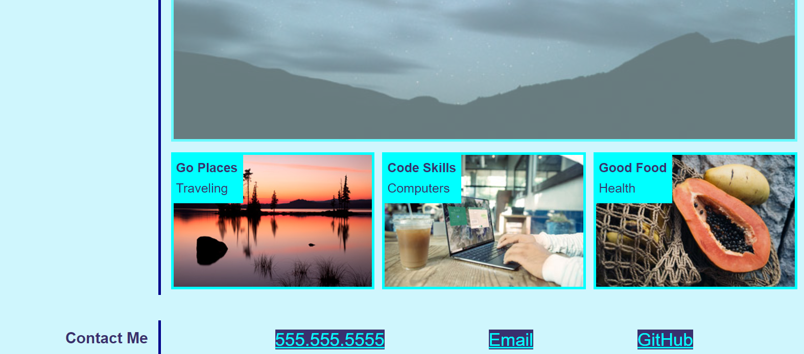

# Homework Week - Professional Portfolio

## The Objective:
* Design a personal portfolio page without any starter htlm or css styling. 

* Add text, photos, links, and styling and make sure it is responsive. 

* Make sure all of the text is easy to read with the appropriate colors. 

* The photos and links should have an overlay when hovering over with your mouse. 

* The page should be responsive for computers, tablets, and cell phones.

* The text and photos should resize and wrap according to the screen size.

* The colors and styling should be easily visible (not too bright or too dark)

## The Finished Product Should Be Similar To The Following:

---

---

---

## Refrence the following links:

[Webpage showing the completed objective](https://carletta88.github.io/homework2/)

[Webpage with the corosponding code](https://github.com/Carletta88/homework2)

